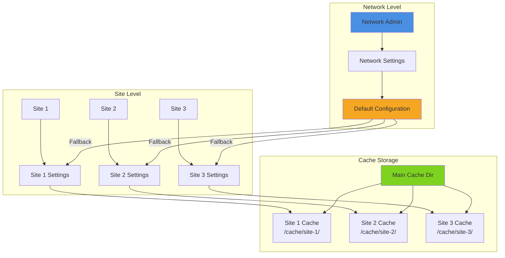
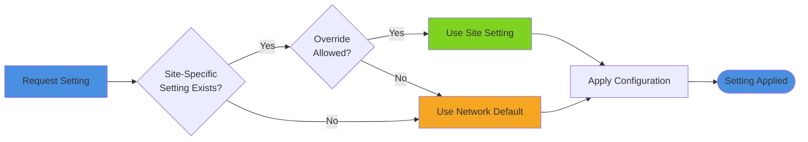

# Multisite Configuration

Configure SpeedMate for WordPress multisite networks with per-site isolation and network-wide defaults.

## Multisite Architecture



### Settings Hierarchy



## Network Activation

### Activate Network-Wide

```bash
wp plugin activate speedmate --network
```

Or via WordPress admin:
1. Network Admin > Plugins
2. Find SpeedMate
3. Click "Network Activate"

## Network-Wide Settings

### Set Default Configuration

In `wp-config.php` (before `ABSPATH`):

```php
// Network-wide SpeedMate defaults
define('SPEEDMATE_NETWORK_MODE', 'beast');
define('SPEEDMATE_NETWORK_TTL', 3600);
define('SPEEDMATE_NETWORK_WEBP', true);
```

### Network Admin Interface

Configure defaults in **Network Admin > Settings > SpeedMate**:

```php
update_site_option('speedmate_network_settings', [
    'default_mode' => 'beast',
    'default_ttl' => 3600,
    'allow_site_override' => true,
    'webp_enabled' => true,
]);
```

## Per-Site Configuration

### Site-Specific Settings

Each site can override network defaults:

```php
switch_to_blog(2);

update_option('speedmate_settings', [
    'mode' => 'static',  // Override network default
    'cache_ttl' => 7200,
]);

restore_current_blog();
```

### Prevent Site Override

```php
update_site_option('speedmate_network_settings', [
    'allow_site_override' => false,  // Sites must use network defaults
]);
```

## Cache Isolation

### Automatic Per-Site Cache

SpeedMate automatically isolates cache per site:

```
cache/speedmate/
├── site-1/
│   ├── html/
│   └── fragments/
├── site-2/
│   ├── html/
│   └── fragments/
└── site-3/
    ├── html/
    └── fragments/
```

### Custom Cache Paths

```php
add_filter('speedmate_cache_dir', function($dir, $blog_id) {
    return WP_CONTENT_DIR . "/cache/site-{$blog_id}/speedmate";
}, 10, 2);
```

## Network-Wide Operations

### Flush All Sites

```bash
wp site list --field=url | xargs -I {} wp speedmate flush --url={}
```

Or programmatically:

```php
function flush_network_cache() {
    $sites = get_sites(['number' => 999]);
    
    foreach ($sites as $site) {
        switch_to_blog($site->blog_id);
        \SpeedMate\Cache\StaticCache::instance()->flush_all();
        restore_current_blog();
    }
}
```

### Warm All Sites

```bash
for site in $(wp site list --field=url); do
  wp speedmate warm --url=$site --urls=$site,$site/about
done
```

### Stats for All Sites

```bash
wp site list --format=csv --fields=blog_id,url | while IFS=, read -r id url; do
  echo "=== Site $id: $url ==="
  wp speedmate stats --url=$url
done
```

## Domain Mapping

### Custom Domains

```php
add_filter('speedmate_cache_key', function($key, $url, $blog_id) {
    // Include domain in cache key for mapped domains
    $domain = parse_url($url, PHP_URL_HOST);
    return $key . '_' . $domain;
}, 10, 3);
```

### Subdomain vs Subdirectory

**Subdomain** (`site1.network.com`):
- Cache isolated automatically by domain
- No special configuration needed

**Subdirectory** (`network.com/site1`):
- Cache isolated by blog_id
- Path automatically included in cache key

## Network Admin Dashboard

### Network-Wide Stats Widget

```php
add_action('wp_network_dashboard_setup', function() {
    wp_add_dashboard_widget(
        'speedmate_network_stats',
        'SpeedMate Network Stats',
        function() {
            $sites = get_sites(['number' => 999]);
            $total_files = 0;
            $total_size = 0;
            
            foreach ($sites as $site) {
                switch_to_blog($site->blog_id);
                $stats = \SpeedMate\Utils\Stats::get();
                $total_files += $stats['total_files'];
                $total_size += $stats['total_size'];
                restore_current_blog();
            }
            
            echo "<p>Total Sites: " . count($sites) . "</p>";
            echo "<p>Total Cache Files: " . number_format($total_files) . "</p>";
            echo "<p>Total Cache Size: " . size_format($total_size) . "</p>";
        }
    );
});
```

## Subdomain Configuration

### Enable Subdomains

In `wp-config.php`:

```php
define('SUBDOMAIN_INSTALL', true);
define('DOMAIN_CURRENT_SITE', 'network.com');
define('PATH_CURRENT_SITE', '/');
```

### Cache by Subdomain

```php
add_filter('speedmate_cache_dir', function($dir, $blog_id) {
    $site = get_blog_details($blog_id);
    $subdomain = str_replace('.network.com', '', $site->domain);
    
    return WP_CONTENT_DIR . "/cache/{$subdomain}/speedmate";
}, 10, 2);
```

## Subdirectory Configuration

### Enable Subdirectories

In `wp-config.php`:

```php
define('SUBDOMAIN_INSTALL', false);
define('DOMAIN_CURRENT_SITE', 'network.com');
define('PATH_CURRENT_SITE', '/');
```

### Cache by Path

```php
add_filter('speedmate_cache_dir', function($dir, $blog_id) {
    $site = get_blog_details($blog_id);
    $path = trim($site->path, '/');
    
    return WP_CONTENT_DIR . "/cache/{$path}/speedmate";
}, 10, 2);
```

## Shared Resources

### Network-Wide Assets

Share optimized images across sites:

```php
add_filter('speedmate_webp_path', function($path, $blog_id) {
    // Store WebP in shared location
    return WP_CONTENT_DIR . '/uploads/shared-webp/';
}, 10, 2);
```

### Shared Critical CSS

```php
add_filter('speedmate_critical_css_dir', function($dir, $blog_id) {
    // Share critical CSS if sites use same theme
    $theme = get_blog_option($blog_id, 'stylesheet');
    return WP_CONTENT_DIR . "/critical-css/{$theme}/";
}, 10, 2);
```

## Per-Site Overrides

### Enable Overrides Selectively

```php
add_filter('speedmate_allow_site_override', function($allow, $blog_id) {
    // Only allow specific sites to override
    $allowed_sites = [2, 5, 8];
    return in_array($blog_id, $allowed_sites);
}, 10, 2);
```

### Override Limits

```php
add_filter('speedmate_site_override_limits', function($limits, $blog_id) {
    return [
        'cache_ttl' => ['min' => 1800, 'max' => 86400],
        'webp_quality' => ['min' => 70, 'max' => 95],
    ];
}, 10, 2);
```

## Resource Quotas

### Per-Site Cache Limits

```php
add_filter('speedmate_cache_size_limit', function($limit, $blog_id) {
    // Different limits based on plan
    $plan = get_blog_option($blog_id, 'plan_type');
    
    switch ($plan) {
        case 'premium':
            return 1024 * 1024 * 1024;  // 1GB
        case 'business':
            return 512 * 1024 * 1024;   // 512MB
        default:
            return 100 * 1024 * 1024;   // 100MB
    }
}, 10, 2);
```

### Enforce Quotas

```php
add_action('speedmate_cache_cleanup', function($blog_id) {
    $limit = apply_filters('speedmate_cache_size_limit', 0, $blog_id);
    $size = \SpeedMate\Utils\Stats::get_cache_size($blog_id);
    
    if ($size > $limit) {
        switch_to_blog($blog_id);
        \SpeedMate\Cache\StaticCache::instance()->cleanup_old();
        restore_current_blog();
    }
});
```

## Site Creation Hook

### Auto-Configure New Sites

```php
add_action('wpmu_new_blog', function($blog_id) {
    switch_to_blog($blog_id);
    
    // Configure SpeedMate for new site
    update_option('speedmate_settings', [
        'mode' => get_site_option('speedmate_network_settings')['default_mode'],
        'cache_ttl' => 3600,
        'webp_enabled' => true,
    ]);
    
    // Create cache directory
    $cache_dir = WP_CONTENT_DIR . "/cache/site-{$blog_id}/speedmate";
    wp_mkdir_p($cache_dir);
    
    restore_current_blog();
});
```

## Migration

### Import Settings to All Sites

```bash
# Export from primary site
wp option get speedmate_settings --format=json > speedmate-settings.json

# Import to all sites
wp site list --field=url | while read url; do
  wp option update speedmate_settings --format=json --url=$url < speedmate-settings.json
done
```

### Migrate Cache Structure

```php
function migrate_cache_structure() {
    $sites = get_sites(['number' => 999]);
    
    foreach ($sites as $site) {
        $old_dir = WP_CONTENT_DIR . "/cache/speedmate-{$site->blog_id}";
        $new_dir = WP_CONTENT_DIR . "/cache/site-{$site->blog_id}/speedmate";
        
        if (file_exists($old_dir)) {
            wp_mkdir_p(dirname($new_dir));
            rename($old_dir, $new_dir);
        }
    }
}
```

## Monitoring

### Network Dashboard

```php
function speedmate_network_dashboard() {
    $sites = get_sites(['number' => 999]);
    
    echo "<h2>SpeedMate Network Status</h2>";
    echo "<table>";
    echo "<tr><th>Site</th><th>Mode</th><th>Cache Size</th><th>Hit Rate</th></tr>";
    
    foreach ($sites as $site) {
        switch_to_blog($site->blog_id);
        
        $settings = get_option('speedmate_settings');
        $stats = \SpeedMate\Utils\Stats::get();
        
        echo "<tr>";
        echo "<td>{$site->blogname}</td>";
        echo "<td>{$settings['mode']}</td>";
        echo "<td>" . size_format($stats['total_size']) . "</td>";
        echo "<td>{$stats['hit_rate']}%</td>";
        echo "</tr>";
        
        restore_current_blog();
    }
    
    echo "</table>";
}
```

## Best Practices

1. **Set Network Defaults**: Use sensible defaults for all sites
2. **Isolate Cache**: Never share cache between sites
3. **Monitor Quotas**: Set and enforce per-site limits
4. **Test on Staging**: Test network-wide changes on staging first
5. **Document Overrides**: Track which sites have custom config

## Next Steps

- [Settings Reference](/config/settings)
- [Cache Control](/config/cache-control)
- [Network Operations](/api/wp-cli)
