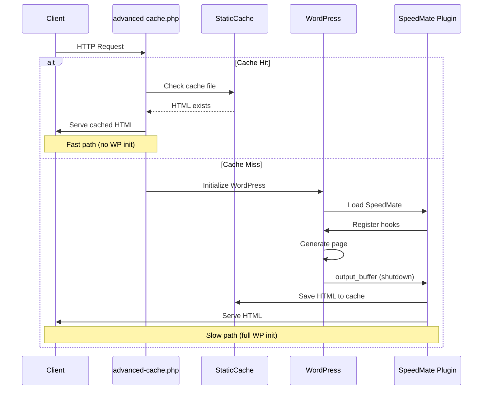

# Architecture

SpeedMate architecture overview and design patterns.

## Overview

SpeedMate follows a modular, singleton-based architecture with clear separation of concerns.

### Component Architecture

```mermaid
graph TB
    subgraph "Bootstrap Layer"
        A[speedmate.php] --> B[Plugin Core]
    end
    
    subgraph "Admin Layer"
        B --> C[Admin Interface]
        C --> C1[Settings Page]
        C --> C2[Health Dashboard]
        C --> C3[Import/Export]
    end
    
    subgraph "Cache Layer"
        B --> D[Cache Engine]
        D --> D1[StaticCache]
        D --> D2[TrafficWarmer]
        D --> D3[DynamicFragments]
    end
    
    subgraph "Media Layer"
        B --> E[Media Optimizer]
        E --> E1[WebPConverter]
        E --> E2[Image Dimensions]
    end
    
    subgraph "Performance Layer"
        B --> F[Perf Features]
        F --> F1[CriticalCSS]
        F --> F2[PreloadHints]
        F --> F3[AutoLCP]
        F --> F4[BeastMode]
    end
    
    subgraph "Utility Layer"
        B --> G[Utils]
        G --> G1[Settings]
        G --> G2[Logger]
        G --> G3[Stats]
        G --> G4[Filesystem]
        G --> G5[Container DI]
    end
    
    subgraph "API Layer"
        B --> H[REST API]
        H --> H1[BatchEndpoints]
        H --> H2[Cache Endpoints]
    end
    
    subgraph "CLI Layer"
        B --> I[WP-CLI]
        I --> I1[Cache Commands]
        I --> I2[Stats Commands]
    end
    
    style B fill:#4A90E2
    style D fill:#7ED321
    style F fill:#F5A623
    style G fill:#BD10E0
```



### Request Lifecycle



## Old Text-Based Diagram

```
speedmate.php (Bootstrap)
    ↓
Plugin (Core Singleton)
    ↓
├── Admin (Admin Interface)
├── Cache (Caching Engine)
│   ├── StaticCache
│   ├── TrafficWarmer
│   └── DynamicFragments
├── Media (Image Optimization)
│   ├── WebPConverter
│   └── MediaOptimizer
├── Perf (Performance Features)
│   ├── CriticalCSS
│   ├── PreloadHints
│   ├── AutoLCP
│   └── BeastMode
├── Utils (Utilities)
│   ├── Settings
│   ├── Logger
│   ├── Stats
│   ├── Filesystem
│   └── Container (DI)
└── API (REST Endpoints)
    └── BatchEndpoints
```

## Core Patterns

### Singleton Pattern

All major components use singleton pattern:

```php
final class StaticCache
{
    private static ?StaticCache $instance = null;

    private function __construct() {}

    public static function instance(): StaticCache
    {
        if (self::$instance === null) {
            self::$instance = new self();
        }
        return self::$instance;
    }
}
```

### Dependency Injection

Container for testing and mocking:

```php
// Production
$cache = StaticCache::instance();

// Testing with mock
Container::set(StaticCache::class, new MockCache());
$cache = StaticCache::instance();  // Returns mock
```

### Hook-Based Architecture

WordPress hooks for extensibility:

```php
// Register hooks in singleton constructor
private function __construct()
{
    add_action('init', [$this, 'register_settings']);
    add_action('save_post', [$this, 'flush_post_cache']);
}
```

## Directory Structure

```
speedmate/
├── includes/
│   ├── Admin/
│   │   ├── Admin.php
│   │   ├── HealthWidget.php
│   │   └── ImportExport.php
│   ├── API/
│   │   └── BatchEndpoints.php
│   ├── Cache/
│   │   ├── StaticCache.php
│   │   ├── TrafficWarmer.php
│   │   ├── DynamicFragments.php
│   │   └── advanced-cache.php
│   ├── CLI/
│   │   └── Commands.php
│   ├── Media/
│   │   ├── MediaOptimizer.php
│   │   └── WebPConverter.php
│   ├── Perf/
│   │   ├── AutoLCP.php
│   │   ├── BeastMode.php
│   │   ├── CriticalCSS.php
│   │   └── PreloadHints.php
│   ├── Utils/
│   │   ├── Container.php
│   │   ├── Filesystem.php
│   │   ├── GarbageCollector.php
│   │   ├── Logger.php
│   │   ├── Multisite.php
│   │   └── Settings.php
│   └── Plugin.php
├── tests/
│   ├── unit/
│   ├── integration/
│   └── e2e/
├── vendor/
├── speedmate.php
└── composer.json
```

## Component Interaction

### Cache Flow

```
Request → advanced-cache.php
    ↓
Cache Check (StaticCache)
    ↓
HIT? → Serve HTML → Exit
    ↓
MISS → WordPress Init
    ↓
Generate HTML
    ↓
Beast Mode Decision
    ↓
Should Cache? → Save to Cache
    ↓
Serve HTML
```

### Beast Mode Flow

```
Page Request
    ↓
Traffic Analysis
    ↓
Calculate Score
    ↓
Check Whitelist/Blacklist
    ↓
Score > Threshold?
    ↓
YES → Auto Cache
    ↓
Traffic Warmer → Pre-cache Related
```

## Data Flow

### Settings Management

```php
// Read settings
$settings = Settings::get();

// Update setting
Settings::refresh();

// Get specific value
$ttl = Settings::get_value('cache_ttl', 3600);
```

### Logging

```php
Logger::log('info', 'cache_hit', [
    'url' => $url,
    'time' => $time,
]);
```

### Stats Collection

```php
// Record cache hit
Stats::record('cache_hit');

// Get stats
$stats = Stats::get();
```

## Performance Considerations

### Early Exit Strategy

`advanced-cache.php` loads before WordPress:

```php
// wp-content/advanced-cache.php
if ($cached_content = check_cache()) {
    echo $cached_content;
    exit;  // Skip WordPress init
}
```

### Lazy Loading

Components load only when needed:

```php
public static function instance(): self
{
    if (self::$instance === null) {
        self::$instance = new self();
        self::$instance->init();  // Lazy init
    }
    return self::$instance;
}
```

### Database Query Optimization

```php
// Use object cache when available
$settings = wp_cache_get('speedmate_settings');
if ($settings === false) {
    $settings = get_option('speedmate_settings');
    wp_cache_set('speedmate_settings', $settings, '', 3600);
}
```

## Error Handling

### Graceful Degradation

```php
try {
    $webp = WebPConverter::convert($image);
} catch (\Exception $e) {
    Logger::log('error', 'webp_conversion_failed', [
        'image' => $image,
        'error' => $e->getMessage(),
    ]);
    // Fall back to original
    return $image;
}
```

### Conditional Features

```php
// Only enable if dependencies available
if (class_exists('\SpeedMate\Utils\Container')) {
    $override = Container::get(self::class);
}
```

## Testing Strategy

### Unit Tests

Test individual components in isolation:

```php
public function test_cache_key_generation()
{
    $cache = new StaticCache();
    $key = $cache->generate_key('https://site.com/page');
    
    $this->assertMatchesRegularExpression('/^[a-f0-9]{32}$/', $key);
}
```

### Integration Tests

Test component interactions:

```php
public function test_beast_mode_auto_caching()
{
    // Simulate traffic
    for ($i = 0; $i < 100; $i++) {
        do_action('speedmate_page_view', '/blog/post');
    }
    
    // Verify auto-cached
    $cached = StaticCache::instance()->is_cached('/blog/post');
    $this->assertTrue($cached);
}
```

### E2E Tests

Test full user flows with Playwright.

## Multisite Architecture

### Per-Site Isolation

```php
public static function get_cache_dir(int $blog_id = null): string
{
    $blog_id = $blog_id ?? get_current_blog_id();
    return SPEEDMATE_CACHE_DIR . '/site-' . $blog_id;
}
```

### Network-Wide Defaults

```php
public static function get_settings(int $blog_id = null): array
{
    $network = get_site_option('speedmate_network_settings');
    $site = get_blog_option($blog_id, 'speedmate_settings');
    
    return wp_parse_args($site, $network);
}
```

## Security

### Nonce Verification

```php
public function handle_flush_request()
{
    if (!wp_verify_nonce($_POST['_wpnonce'], 'speedmate_flush')) {
        wp_die('Invalid nonce');
    }
    
    $this->flush_cache();
}
```

### Capability Checks

```php
public function register_admin_menu()
{
    add_options_page(
        'SpeedMate',
        'SpeedMate',
        'manage_options',  // Capability required
        'speedmate',
        [$this, 'render_settings_page']
    );
}
```

### Input Sanitization

```php
public function save_settings($settings)
{
    return [
        'mode' => sanitize_text_field($settings['mode']),
        'cache_ttl' => absint($settings['cache_ttl']),
        'webp_enabled' => (bool) $settings['webp_enabled'],
    ];
}
```

## Extensibility

### Filter Points

Every major decision has a filter:

```php
$ttl = apply_filters('speedmate_cache_ttl', $default_ttl, $url);
$exclude = apply_filters('speedmate_cache_exclude_urls', [], $url);
$score = apply_filters('speedmate_beast_score', $calculated, $url, $data);
```

### Action Hooks

Events for monitoring and integration:

```php
do_action('speedmate_cache_flushed', $type, $pattern);
do_action('speedmate_beast_decision', $decision, $url, $score);
do_action('speedmate_webp_converted', $source, $webp);
```

## Next Steps

- [Testing Guide](/dev/testing)
- [Contributing](/dev/contributing)
- [Hooks Reference](/api/hooks)
