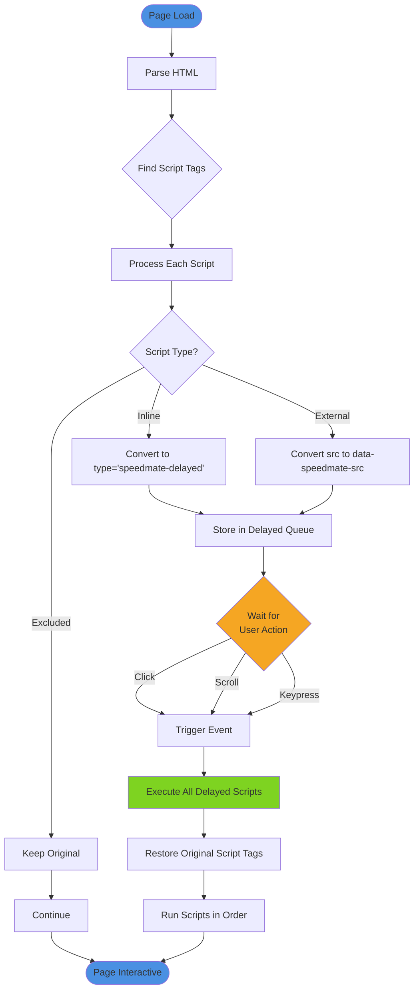

# Beast Mode

Beast Mode is SpeedMate's aggressive JavaScript delay strategy that defers all script execution until user interaction.

## What is Beast Mode?

Unlike Safe Mode which uses standard optimizations, Beast Mode delays JavaScript execution until the first user interaction (click, scroll, or keypress):

- **Delayed Execution**: All `<script>` tags converted to delayed format
- **User-Triggered**: Scripts execute on first click/scroll/keypress
- **LCP Optimization**: Prioritizes visual content loading
- **Aggressive**: Maximum performance at cost of delayed interactivity

## How It Works

### JavaScript Delay Flow



### Performance Impact

```mermaid
gantt
    title Page Load Timeline Comparison
    dateFormat X
    axisFormat %s
    
    section Safe Mode
    HTML Parse          :0, 200
    CSS Load           :200, 400
    JS Download        :400, 800
    JS Parse/Execute   :800, 1200
    LCP                :1200, 1400
    FCP                :400, 600
    Interactive        :1200, 1400
    
    section Beast Mode
    HTML Parse          :0, 200
    CSS Load           :200, 400
    LCP                :400, 600
    FCP                :200, 400
    User Interaction   :600, 1000
    JS Download        :1000, 1400
    JS Parse/Execute   :1400, 1800
    Interactive        :1400, 1800
```



## How It Works (Text)

```
User Request → Page Load → Parse HTML
                              ↓
                        Find <script> tags
                              ↓
                        Convert to delayed format
                              ↓
                        Wait for user interaction
                              ↓
                        (click/scroll/keypress)
                              ↓
                        Execute all scripts
```

### Scoring Algorithm

Beast Mode scores pages based on:

1. **Request Count**: Number of requests in time window
2. **Request Rate**: Requests per minute
3. **Response Time**: Average page generation time
4. **Resource Usage**: Memory and database query count

Formula:
```
score = (requests * 10) + (rate * 5) + (response_time / 100)
```

Threshold: `score >= 50` triggers auto-caching

## Configuration

### Enable Beast Mode

```php
update_option('speedmate_settings', [
    'mode' => 'beast',
    'beast_threshold' => 50,        // Minimum score
    'beast_time_window' => 3600,    // 1 hour window
    'beast_whitelist' => [],        // Always cache
    'beast_blacklist' => [],        // Never cache
]);
```

### Via WordPress Admin

1. Navigate to **Settings > SpeedMate**
2. Set **Mode** to `Beast`
3. Configure threshold and whitelist
4. Save changes

## Whitelist Rules

Force-cache specific patterns:

```php
update_option('speedmate_settings', [
    'beast_whitelist' => [
        '/blog/*',           // All blog posts
        '/category/*',       // All categories
        '/tag/*',           // All tags
        '/shop/*',          // All shop pages
        '/',                // Homepage
    ]
]);
```

### Programmatic Whitelist

```php
add_filter('speedmate_beast_whitelist', function($whitelist) {
    // Add custom post type
    $whitelist[] = '/products/*';
    
    // Add specific pages
    $whitelist[] = '/about';
    $whitelist[] = '/contact';
    
    return $whitelist;
});
```

## Blacklist Rules

Exclude specific patterns from Beast Mode:

```php
update_option('speedmate_settings', [
    'beast_blacklist' => [
        '/checkout/*',       // E-commerce checkout
        '/cart/*',          // Shopping cart
        '/my-account/*',    // User account pages
        '/admin/*',         // Admin pages
    ]
]);
```

### Default Exclusions

Beast Mode automatically excludes:

- Admin pages (`/wp-admin/*`)
- User account pages
- Checkout/cart pages (WooCommerce)
- Search results
- Preview pages
- Password-protected pages

## Traffic Analysis

### Real-Time Monitoring

```bash
# View current traffic stats
wp speedmate stats

# Monitor Beast Mode decisions
tail -f wp-content/speedmate.log | grep beast
```

### Traffic Data Structure

```json
{
  "url": "/blog/post-name",
  "hits": 142,
  "rate": 2.3,
  "avg_response": 450,
  "score": 87,
  "cached": true,
  "cache_time": "2026-01-22T10:30:00Z"
}
```

## Performance Metrics

### Before Beast Mode

```
High Traffic Page:
- Requests: 1000/hour
- Response Time: 500ms
- Database Queries: 80/request
- Memory Usage: 80MB
- Total Time: 500 seconds
```

### After Beast Mode

```
High Traffic Page:
- Requests: 1000/hour  
- Response Time: 3ms (cached)
- Database Queries: 0/request
- Memory Usage: 5MB
- Total Time: 3 seconds
```

**Performance Gain**: 99.4% faster

## Advanced Features

### Adaptive Caching

Beast Mode adapts cache strategy based on:

1. **Time of Day**: Higher threshold during low traffic
2. **Day of Week**: Lower threshold on weekends
3. **Seasonal Traffic**: Adjusts for traffic spikes
4. **Resource Availability**: Reduces caching under load

```php
add_filter('speedmate_beast_threshold', function($threshold) {
    $hour = (int) date('H');
    
    // Lower threshold during business hours
    if ($hour >= 9 && $hour <= 17) {
        return $threshold * 0.8;
    }
    
    // Higher threshold at night
    return $threshold * 1.2;
});
```

### Cache Warming Integration

Beast Mode automatically triggers cache warming for:

- Related posts
- Category archives
- Author pages
- Next/previous pagination

### Dynamic TTL

Cache lifetime adjusts based on update frequency:

```php
add_filter('speedmate_beast_ttl', function($ttl, $url) {
    // Longer TTL for static pages
    if (preg_match('/^\/(about|contact)/', $url)) {
        return 86400; // 24 hours
    }
    
    // Shorter TTL for blog posts
    if (preg_match('/^\/blog\//', $url)) {
        return 3600; // 1 hour
    }
    
    return $ttl;
}, 10, 2);
```

## Monitoring

### Dashboard Widget

View Beast Mode stats in WordPress admin:

```
Beast Mode Status
━━━━━━━━━━━━━━━━━━━━
Status:        Active
Auto-Cached:   142 pages
Traffic Hits:  1,245
Avg Score:     67
Cache Hit Rate: 94.2%
```

### WP-CLI Monitoring

```bash
# Beast Mode stats
wp speedmate info | grep -A5 "Beast Mode"

# Top scoring pages
wp eval "print_r(\SpeedMate\Utils\Stats::get_top_scored());"

# Recent auto-cached pages
wp eval "print_r(\SpeedMate\Utils\Stats::get_recent_cached());"
```

### Logging

```php
// Enable Beast Mode logging
update_option('speedmate_settings', [
    'logging_enabled' => true,
    'log_level' => 'info'
]);
```

Log entries:
```json
{
  "level": "info",
  "event": "beast_auto_cache",
  "url": "/blog/popular-post",
  "score": 87,
  "threshold": 50,
  "timestamp": "2026-01-22T10:30:00Z"
}
```

## Best Practices

1. **Start with Conservative Threshold**: Use default 50, adjust based on traffic
2. **Monitor Regularly**: Check cache hit rates and scores
3. **Use Whitelist for Critical Pages**: Force-cache homepage, landing pages
4. **Blacklist User-Specific Content**: Exclude checkout, account pages
5. **Enable Cache Warming**: Pre-cache likely navigation paths
6. **Review Logs Periodically**: Identify patterns and adjust rules

## Troubleshooting

### Pages Not Auto-Caching

1. Check traffic meets threshold
2. Verify page not in blacklist
3. Review exclusion rules
4. Check cache directory permissions

### Too Many Pages Cached

1. Increase threshold
2. Add patterns to blacklist
3. Reduce time window
4. Enable stricter scoring

### Cache Thrashing

1. Increase TTL
2. Reduce auto-invalidation triggers
3. Use cache warming
4. Review whitelist rules

## Next Steps

- [Configure Whitelist Rules](/config/beast-mode)
- [Traffic Warmer Integration](/features/traffic-warmer)
- [Monitor with Dashboard Widget](/features/static-cache)
