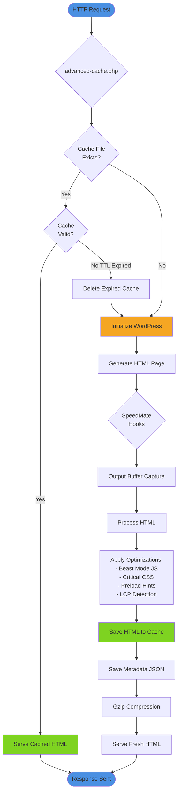
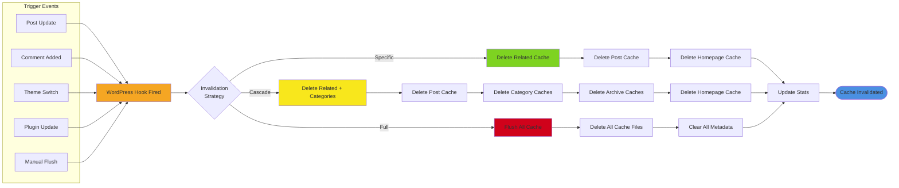

# Static Cache

SpeedMate's static cache engine stores fully-rendered HTML pages on disk, serving them directly without initializing WordPress.

## How It Works

### Cache Flow Diagram



### Cache Invalidation Flow



## Detailed Process

1. **First Request**: WordPress generates HTML, SpeedMate saves it to disk
2. **Subsequent Requests**: `advanced-cache.php` serves cached HTML directly
3. **Cache Invalidation**: Automatic invalidation on post updates, comments, etc.
4. **Cache Expiration**: TTL-based expiration with configurable lifetime

## Architecture (Legacy Text Diagram)

```
Request → advanced-cache.php → Cache Check
                                    ↓
                            Cache Hit? → Serve HTML (fast)
                                    ↓
                            Cache Miss → WordPress Init
                                              ↓
                                         Generate HTML
                                              ↓
                                         Save to Cache
                                              ↓
                                         Serve HTML
```

## Cache Storage

Cache files are stored in `wp-content/cache/speedmate/`:

```
cache/speedmate/
├── html/
│   ├── example.com/
│   │   ├── index.html
│   │   ├── about.html
│   │   └── blog/
│   │       └── post-name.html
│   └── example.com.meta/
│       ├── index.json
│       └── about.json
└── fragments/
    └── dynamic-widgets/
```

### Cache File Structure

**HTML Files**: Gzip-compressed HTML content
**Meta Files**: JSON metadata with:
- Creation timestamp
- Expiration timestamp
- Request headers
- User agent
- Cache key

## Cache Keys

Cache keys are generated based on:

- Request URI
- Query string parameters
- User agent (mobile/desktop)
- Cookies (logged-in users)
- Custom headers

Example cache key:
```
md5(uri + query_string + user_agent + cookies) = abc123def456
```

## Cache Invalidation

### Automatic Invalidation

SpeedMate automatically invalidates cache when:

- Post/page published or updated
- Comment added/modified
- Theme switched
- Plugin activated/deactivated
- Settings changed

### Manual Invalidation

```bash
# Flush all cache
wp speedmate flush

# Flush specific pattern
wp speedmate flush --pattern=/blog/*

# Via REST API
curl -X POST /wp-json/speedmate/v1/cache/flush \
  -H "X-WP-Nonce: $NONCE"
```

### Programmatic Invalidation

```php
// Flush single URL
\SpeedMate\Cache\StaticCache::instance()->flush_url('https://site.com/page');

// Flush by pattern
\SpeedMate\Cache\StaticCache::instance()->flush_pattern('/blog/*');

// Flush all
\SpeedMate\Cache\StaticCache::instance()->flush_all();
```

## Configuration

### Basic Settings

```php
update_option('speedmate_settings', [
    'mode' => 'static',        // Enable static cache
    'cache_ttl' => 3600,       // 1 hour lifetime
    'gzip_enabled' => true,    // Enable gzip compression
    'cache_logged_in' => false // Don't cache logged-in users
]);
```

### Advanced Options

```php
// Exclude specific URLs from cache
add_filter('speedmate_cache_exclude', function($exclude) {
    $exclude[] = '/checkout/*';
    $exclude[] = '/my-account/*';
    return $exclude;
});

// Customize cache key
add_filter('speedmate_cache_key', function($key, $url) {
    // Add custom parameter to cache key
    if (isset($_GET['custom'])) {
        $key .= '_custom_' . $_GET['custom'];
    }
    return $key;
}, 10, 2);

// Modify cached HTML before serving
add_filter('speedmate_cached_html', function($html) {
    // Inject timestamp
    $html = str_replace(
        '</body>',
        '<!-- Cached: ' . date('Y-m-d H:i:s') . ' --></body>',
        $html
    );
    return $html;
});
```

## Cache Headers

SpeedMate adds custom headers to identify cache status:

```
X-Cache: HIT              # Served from cache
X-Cache: MISS             # Generated by WordPress
X-Cache-Time: 0.002s      # Time to serve
X-Cache-Age: 245          # Age in seconds
```

## Performance Impact

**Without Cache:**
- Average response time: 500-1000ms
- Database queries: 50-100 per request
- Memory usage: 50-100MB

**With Static Cache:**
- Average response time: 2-5ms
- Database queries: 0
- Memory usage: < 5MB

## Best Practices

1. **Set Appropriate TTL**: Balance freshness vs performance
2. **Monitor Hit Rate**: Aim for 90%+ hit rate
3. **Use Cache Warming**: Pre-cache popular pages
4. **Exclude Dynamic Content**: Don't cache user-specific pages
5. **Enable Gzip**: Reduce bandwidth usage

## Troubleshooting

### Cache Not Working

```bash
# Check cache directory permissions
ls -la wp-content/cache/speedmate/

# Verify advanced-cache.php exists
ls -la wp-content/advanced-cache.php

# Check WP_CACHE constant
wp config get WP_CACHE
```

### Low Hit Rate

1. Check exclusion rules
2. Verify TTL is not too short
3. Review cache invalidation triggers
4. Check for dynamic content in templates

### Cache Size Growing

```bash
# Check cache size
du -sh wp-content/cache/speedmate/

# Run garbage collection
wp speedmate gc

# Set up cron for regular cleanup
0 3 * * * wp speedmate gc --path=/var/www/html
```

## Next Steps

- [Enable Beast Mode](/features/beast-mode)
- [Configure Cache Control](/config/cache-control)
- [Traffic Warmer](/features/traffic-warmer)
